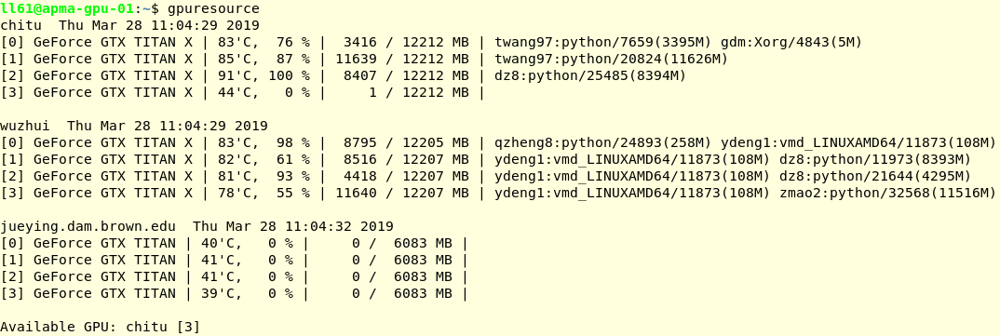

% $\Sigma\Sigma_{Job}$: Sums~Job~ (**S**imple **U**tility for **M**ultiple-**S**ervers **Job** **Sub**mission)
% Lu Lu
% Dec 9, 2021

# Assume you have GPU servers: `server1`, `server2`, ...

When you need to run a code from your computer, you will

1. Select one server and log in

       $ ssh LAN (May first log in a local area network)
       $ ssh server1

1. Check GPU status. If no free GPU, go to step 1

   `$ nvidia-smi` or `$ gpustat`

1. Copy the code from your computer to the server

       $ scp -r codes server1:~/project/codes

1. Run the code in the server

       $ cd ~/project/codes
       $ CUDA_VISIBLE_DEVICES=0 python main.py

1. Transfer back the results

       $ scp server1:~/project/codes/ml.dat .

# One week later...

Cause I am lazy, I am crazy.

# $\Sigma\Sigma_{Job}$

Sums~Job~ (**S**imple **U**tility for **M**ultiple-**S**ervers **Job** **Sub**mission)

- A simple Linux __*command-line utility*__ which __*submits a job*__ to one of the __*multiple servers*__ each with limited resources.

Features

- Simple to use: commands `gpuresource` and `submit` are all your need
- Automatically choose available GPUs among all the servers
- interactively: just as the job is running in your local machine
    + Display the output of the job in real time
    + Kill the job by Ctrl-C
    + Save the output in a log file
    + Transfer back the files you specified

# `$ gpuresource`

Show the status of GPUs on all servers.

# `$ submit jobfile jobname`

Automatically do the following:

1. Find a server with free GPU
1. Copy the code to the server
1. Run the job on it
1. When the code finishes, transfer back the results

- `jobfile` : File to be run
- `jobname` : Job name, and also the folder name of the job. If not provided, a random number will be used.

Options:

- `-h`, `--help` : Show this help message and exit
- `-s SERVER`, `--server SERVER` : Server host name
- `--gpuid GPUID` : GPU ID to be used; -1 to use CPU only
